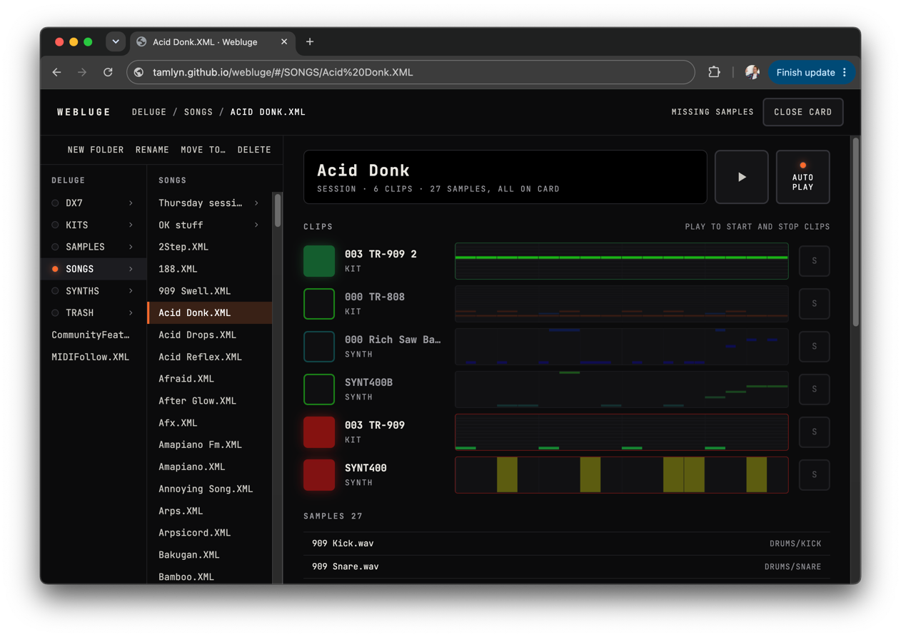

# Webluge

A [Deluge](https://synthstrom.com/product/deluge/) SD card manager and player.

- Move, delete and rename songs, synths, kits and samples while keeping references up-to-date.
- Audition songs, synths, kits and samples.
- Find and re-link missing samples.
- Nothing to install.



> Hang on, did you say "audition songs"? How does that work?

The web page includes the full Deluge firmware, compiled to WebAssembly. It plays identically to the hardware, save for some inaudible floating point integer differences due to the CPU architecture.

**Try it:** [tamlyn.github.io/webluge](https://tamlyn.github.io/webluge/). Open a copy of your SD card to browse it, audition samples, kits and synths, and play songs, starting and stopping clips as you would in session view. It needs the File System Access API, so Chrome or Edge only.

It opens in readonly mode by default. If you try to move/edit/rename something, it will request write access.

### Back up your SD card before enabling write access

I've tested it and it seems fine, but I can't guarantee it won't mangle your files or delete your auntie.

## Development

### Building

The toolchain (Emscripten, CMake, Ninja, Node) and tasks are in `mise.toml`.

```sh
git clone --recurse-submodules git@github.com:tamlyn/webluge.git
cd webluge
mise install
mise run dev    # build the firmware and start the web app's dev server
mise run test   # firmware and web app tests
mise run build  # firmware and web app, into build and web/dist
```

`mise tasks` lists the rest. The firmware build includes a Node CLI for loading and rendering songs offline. Run
`mise exec -- node build/webluge.js` for usage.

### Firmware

`DelugeFirmware` is a submodule pointing at [a fork](https://github.com/tamlyn/DelugeFirmware), pinned to release 1.2.1 plus a few small changes. [UPSTREAM.md](docs/UPSTREAM.md) explains how those are kept and how to move to a new release. [ARM_AUDIT.md](docs/ARM_AUDIT.md) lists the ARM-specific code and how each piece runs on the host.
